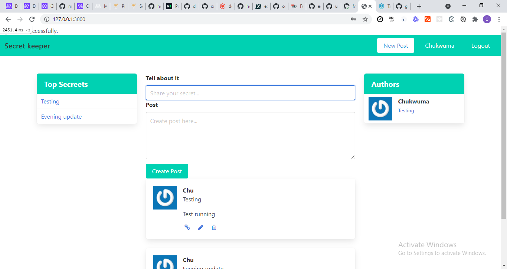

Secreet Keeper

An exclusive clubhouse where your members can write anonymous posts. Where only the members can see who the author of the post is.

Built With
Ruby on Rails
Ruby
Getting Started
To get a local copy of the repository please run the following commands on your terminal:

$ cd folder-name

git clone git@github.com:EroAuditore/secreet_keeper.git
$ cd secreet_keeper
$ bundle install 
$ rails db:migrate
$ yarn install --check-files

Authors

👤 Eduardo Rodriguez

Github: @EroAuditore
Linkedin: EroAuditore

👤 Chukwuma Obasi

GitHub: @ccobasi
LinkedIn: chukwuma-obasi

🤝 Contributing
Contributions, issues, and feature requests are welcome!

Contributing
Contributions, issues and feature requests are welcome! Start by:

Forking the project
Cloning the project to your local machine
cd into the project directory
Run git checkout -b your-branch-name
Make your contributions
Push your branch up to your forked repository
Open a Pull Request with a detailed description to the development branch of the original project for a review
Show your support
Give a ⭐️ if you like this project